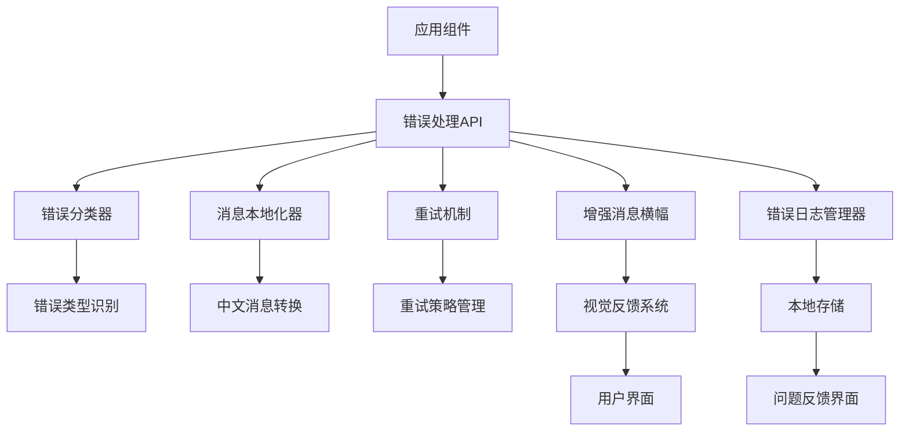

# 错误消息反馈系统增强设计文档

## 概述

本设计文档描述了对现有活动管理平台错误反馈系统的全面增强。当前系统使用简单的 banner 消息显示错误和成功信息，但缺乏智能错误分类、用户友好的中文消息转换、重试机制和错误历史跟踪等功能。

增强后的系统将提供：
- 智能错误分类和本地化
- 基于错误类型的视觉反馈
- 可重试操作的自动重试机制
- 简化的错误日志（用于问题反馈）
- 统一的错误处理API

## 架构

### 系统架构图



### 分层架构

1. **表现层 (Presentation Layer)**
   - 增强的消息横幅组件
   - 简化的错误日志界面
   - 重试按钮和加载状态

2. **业务逻辑层 (Business Logic Layer)**
   - 错误处理API
   - 错误分类器
   - 消息本地化器
   - 重试机制

3. **数据层 (Data Layer)**
   - 错误日志管理器
   - 本地存储接口

## 组件和接口

### 1. 错误处理API (ErrorHandler)

```typescript
interface ErrorHandlerAPI {
  // 主要错误处理方法
  handleError(error: any, context?: ErrorContext): ErrorResponse
  
  // 显示消息方法
  showMessage(type: MessageType, message: string, options?: MessageOptions): void
  
  // 重试相关方法
  enableRetry(operation: () => Promise<any>, options?: RetryOptions): void
  
  // 日志管理方法
  getErrorLog(): ErrorRecord[]
  clearErrorLog(): void
}

interface ErrorContext {
  operation: string
  component: string
  userId?: string
  additionalData?: Record<string, any>
}

interface ErrorResponse {
  id: string
  type: ErrorType
  message: string
  canRetry: boolean
  severity: MessageSeverity
  suggestions?: string[]
}
```

### 2. 错误分类器 (ErrorClassifier)

```typescript
interface ErrorClassifier {
  classifyError(error: any): ErrorClassification
  isRetryable(error: any): boolean
  getSeverity(error: any): MessageSeverity
}

interface ErrorClassification {
  type: ErrorType
  category: ErrorCategory
  isRetryable: boolean
  severity: MessageSeverity
  originalError: any
}

enum ErrorType {
  NETWORK = 'network',
  PERMISSION = 'permission',
  VALIDATION = 'validation',
  TIMEOUT = 'timeout',
  SERVER = 'server',
  CLIENT = 'client',
  UNKNOWN = 'unknown'
}

enum ErrorCategory {
  FATAL = 'fatal',
  WARNING = 'warning',
  INFO = 'info',
  SUCCESS = 'success'
}
```

### 3. 消息本地化器 (MessageLocalizer)

```typescript
interface MessageLocalizer {
  localize(error: any, context?: ErrorContext): LocalizedMessage
  getErrorSuggestions(errorType: ErrorType): string[]
}

interface LocalizedMessage {
  title: string
  message: string
  suggestions: string[]
  actionText?: string
}
```

### 4. 重试机制 (RetryMechanism)

```typescript
interface RetryMechanism {
  createRetryableOperation(operation: () => Promise<any>, options?: RetryOptions): RetryableOperation
  executeWithRetry(operation: () => Promise<any>, options?: RetryOptions): Promise<any>
}

interface RetryOptions {
  maxAttempts: number
  baseDelay: number
  backoffMultiplier: number
  timeout: number
}

interface RetryableOperation {
  execute(): Promise<any>
  retry(): Promise<any>
  canRetry(): boolean
  getAttemptCount(): number
}
```

### 5. 增强消息横幅 (EnhancedMessageBanner)

```typescript
interface EnhancedMessageBanner {
  show(message: BannerMessage): void
  hide(): void
  update(messageId: string, updates: Partial<BannerMessage>): void
}

interface BannerMessage {
  id: string
  type: MessageType
  title?: string
  message: string
  duration?: number
  canRetry?: boolean
  onRetry?: () => void
  suggestions?: string[]
  icon?: string
}

enum MessageType {
  SUCCESS = 'success',
  INFO = 'info', 
  WARNING = 'warning',
  ERROR = 'error'
}
```

### 6. 错误日志管理器 (ErrorLogManager)

```typescript
interface ErrorLogManager {
  // 记录管理
  addRecord(error: ErrorRecord): void
  getRecords(limit?: number): ErrorRecord[]
  clearRecords(): void
  
  // 问题反馈
  generateFeedbackReport(): FeedbackReport
  copyToClipboard(): void
}

interface FeedbackReport {
  summary: string
  errors: ErrorRecord[]
  environment: EnvironmentInfo
  timestamp: Date
}
```

## 数据模型

### 错误记录模型

```typescript
interface ErrorRecord {
  id: string
  timestamp: Date
  type: ErrorType
  severity: MessageSeverity
  message: string
  originalError: any
  context: ErrorContext
  retryCount: number
  userAgent: string
}
```

### 消息配置模型

```typescript
interface MessageConfig {
  type: MessageType
  duration: number
  showIcon: boolean
  allowDismiss: boolean
  showRetry: boolean
  maxRetries: number
}
```

## 错误日志用户界面

错误日志设计为简单的问题反馈工具，不需要用户过多操心：

1. **访问入口**
   - 在个人主页/设置页面提供"错误日志"入口
   - 仅在用户主动需要反馈问题时使用

2. **简化的日志界面**
   - **只读错误列表**: 显示最近的错误记录，用户无需管理
   - **一键复制**: 提供"复制错误信息"按钮，方便反馈给开发者
   - **问题反馈**: 集成问题反馈表单，可以直接发送错误日志
   - **自动清理**: 系统自动管理存储，用户无需手动清理

3. **开发者友好的信息**
   - 包含完整的技术错误信息
   - 浏览器环境信息
   - 操作步骤重现信息
   - 时间戳和用户ID（如果已登录）

4. **隐私保护**
   - 自动过滤敏感信息（密码、token等）
   - 用户可以选择是否包含个人信息
   - 本地存储，不会自动上传

## 错误处理

### 错误分类策略

1. **网络错误**
   - 连接超时
   - 网络不可达
   - DNS解析失败
   - 服务器无响应

2. **权限错误**
   - 未授权访问 (401)
   - 权限不足 (403)
   - 资源不存在 (404)

3. **验证错误**
   - 表单字段验证失败
   - 数据格式错误
   - 必填字段缺失

4. **服务器错误**
   - 内部服务器错误 (500)
   - 服务不可用 (503)
   - 数据库连接失败

5. **客户端错误**
   - JavaScript运行时错误
   - 资源加载失败
   - 浏览器兼容性问题

### 错误恢复策略

1. **自动重试**
   - 网络请求失败
   - 临时服务器错误
   - 超时错误

2. **用户引导**
   - 权限错误提供获取权限步骤
   - 验证错误提供修正建议
   - 网络错误提供故障排除指南

3. **降级处理**
   - 非关键功能失败时继续核心功能
   - 提供离线模式或缓存数据
   - 简化用户界面减少错误可能性

## 正确性属性

*属性是一个特征或行为，应该在系统的所有有效执行中保持为真——本质上是关于系统应该做什么的正式声明。属性作为人类可读规范和机器可验证正确性保证之间的桥梁。*

### 属性反思

在分析所有可测试属性后，我识别出以下可以合并或优化的冗余属性：

- 属性2.1-2.4都测试不同消息类型的UI样式，可以合并为一个综合属性
- 属性5.1-5.5都测试错误建议功能，可以合并为一个通用属性
- 属性3.1和3.4测试重试按钮的显示逻辑，可以合并
- 简化错误历史相关属性，专注于问题反馈功能

经过反思，以下是优化后的核心属性：

### 属性 1: 中文消息本地化
*对于任何*系统错误，错误反馈系统应该显示用户友好的中文消息而不是技术性的英文错误消息
**验证需求: 1.1, 1.2**

### 属性 2: 特定错误类型处理
*对于任何*网络或权限错误，错误反馈系统应该显示预定义的标准中文错误消息
**验证需求: 1.3, 1.4**

### 属性 3: 验证错误详细信息
*对于任何*数据验证失败，错误反馈系统应该显示包含具体字段信息的错误消息
**验证需求: 1.5**

### 属性 4: 消息类型视觉反馈
*对于任何*消息类型（成功、信息、警告、错误），错误反馈系统应该使用对应的颜色主题和图标进行显示
**验证需求: 2.1, 2.2, 2.3, 2.4**

### 属性 5: 错误消息显示时长
*对于任何*错误或警告消息，显示时间应该比成功或信息消息更长
**验证需求: 2.5**

### 属性 6: 重试按钮显示逻辑
*对于任何*错误，当且仅当错误可重试时，错误反馈系统应该显示重试按钮
**验证需求: 3.1, 3.4**

### 属性 7: 重试操作执行
*对于任何*重试操作，点击重试按钮应该重新执行原始失败的操作
**验证需求: 3.2**

### 属性 8: 重试限制处理
*对于任何*重试操作，当重试次数超过最大限制时，重试按钮应该被隐藏并显示支持建议
**验证需求: 3.3**

### 属性 9: 重试状态管理
*对于任何*正在进行的重试操作，重试按钮应该显示加载状态并被禁用
**验证需求: 3.5**

### 属性 10: 错误分类准确性
*对于任何*输入错误，错误分类器应该返回正确的错误类型和处理策略
**验证需求: 4.1**

### 属性 11: 上下文感知消息
*对于任何*包含上下文信息的错误，生成的错误消息应该比无上下文的消息更具体
**验证需求: 4.2**

### 属性 12: 重复消息合并
*对于任何*连续发生的相同类型错误，错误反馈系统应该合并显示而不是重复显示多个消息
**验证需求: 4.3**

### 属性 13: 错误日志记录
*对于任何*错误，详细的技术错误信息应该被记录到控制台用于调试
**验证需求: 4.4**

### 属性 14: API响应格式标准化
*对于任何*错误处理API调用，返回的响应应该符合标准化的错误响应格式
**验证需求: 4.5**

### 属性 15: 错误建议提供
*对于任何*特定类型的错误（表单验证、文件上传、权限、网络、超时），错误消息应该包含相应的解决建议
**验证需求: 5.1, 5.2, 5.3, 5.4, 5.5**

### 属性 16: 错误日志记录
*对于任何*发生的错误，错误记录应该被保存到本地存储中用于问题反馈
**验证需求: 6.1**

### 属性 17: 错误日志显示限制
*对于任何*错误日志查询，应该最多显示最近的错误记录
**验证需求: 6.2**

### 属性 18: 错误日志清除
*对于任何*清除操作，所有本地存储的错误记录应该被删除
**验证需求: 6.4**

### 属性 19: 存储限制管理
*对于任何*超过存储限制的错误记录，最旧的记录应该被自动删除
**验证需求: 6.5**

## 测试策略

### 单元测试

单元测试将验证各个组件的具体功能：

- **错误分类器测试**: 验证不同错误类型的正确分类
- **消息本地化器测试**: 验证英文错误到中文消息的转换
- **重试机制测试**: 验证重试逻辑和退避策略
- **本地存储测试**: 验证错误记录的存储和检索

### 属性基础测试

属性基础测试将使用 **fast-check** 库来验证系统的通用正确性属性。每个属性基础测试将运行最少100次迭代以确保充分的随机输入覆盖。

**属性基础测试要求**:
- 使用 fast-check 作为属性测试库
- 每个测试最少运行100次迭代
- 每个属性基础测试必须用注释明确引用设计文档中的正确性属性
- 使用格式: `**Feature: error-message-enhancement, Property {number}: {property_text}**`

**测试生成器策略**:
- **错误生成器**: 生成各种类型的错误对象（网络、权限、验证等）
- **上下文生成器**: 生成不同的错误上下文信息
- **消息生成器**: 生成包含技术术语的错误消息
- **重试场景生成器**: 生成不同的重试配置和失败场景

### 集成测试

集成测试将验证组件间的协作：

- **端到端错误处理流程**: 从错误发生到用户看到消息的完整流程
- **重试机制集成**: 验证重试与错误显示的协调工作
- **错误日志集成**: 验证错误记录与问题反馈的集成

### 用户界面测试

- **视觉回归测试**: 确保不同错误类型的视觉样式正确
- **交互测试**: 验证重试按钮、关闭按钮等交互功能
- **响应式测试**: 确保错误消息在不同设备上正确显示

### 性能测试

- **消息显示性能**: 确保错误消息能够快速显示
- **存储性能**: 验证大量错误记录的存储和检索性能
- **内存泄漏测试**: 确保长时间运行不会导致内存泄漏