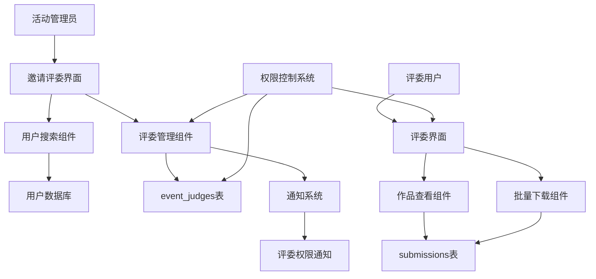

# 邀请评委功能设计文档

## 概述

邀请评委功能为活动管理平台提供了一个完整的评委管理系统。活动管理员可以搜索并邀请已注册用户担任特定活动的评委，被邀请用户将立即获得评委权限，可以访问专门的评委界面查看和下载作品，但无法查看参与者个人信息。

## 架构

### 系统架构图



### 数据流

1. **邀请流程**: 管理员 → 搜索用户 → 选择用户 → 创建评委记录 → 发送通知
2. **权限验证**: 用户访问 → 权限检查 → 评委界面/拒绝访问
3. **作品查看**: 评委 → 权限验证 → 作品列表 → 批量下载

## 组件和接口

### 数据库组件

#### event_judges 表
```sql
CREATE TABLE event_judges (
    id UUID PRIMARY KEY DEFAULT gen_random_uuid(),
    event_id UUID NOT NULL REFERENCES events(id) ON DELETE CASCADE,
    user_id UUID NOT NULL REFERENCES profiles(id) ON DELETE CASCADE,
    created_at TIMESTAMPTZ DEFAULT NOW(),
    updated_at TIMESTAMPTZ DEFAULT NOW(),
    UNIQUE(event_id, user_id)
);

-- 索引优化
CREATE INDEX idx_event_judges_event_id ON event_judges(event_id);
CREATE INDEX idx_event_judges_user_id ON event_judges(user_id);
```

#### RLS 策略
```sql
-- 查看权限：活动创建者和评委本人可以查看
CREATE POLICY "event_judges_select" ON event_judges FOR SELECT USING (
    auth.uid() IN (
        SELECT created_by FROM events WHERE id = event_id
        UNION
        SELECT user_id WHERE user_id = auth.uid()
    )
);

-- 插入权限：只有活动创建者可以邀请评委
CREATE POLICY "event_judges_insert" ON event_judges FOR INSERT WITH CHECK (
    auth.uid() IN (SELECT created_by FROM events WHERE id = event_id)
);

-- 删除权限：只有活动创建者可以移除评委
CREATE POLICY "event_judges_delete" ON event_judges FOR DELETE USING (
    auth.uid() IN (SELECT created_by FROM events WHERE id = event_id)
);
```

### 前端组件

#### JudgeInvitationModal.vue
```typescript
interface Props {
  eventId: string
  isOpen: boolean
}

interface Emits {
  close: []
  judgeInvited: [userId: string]
}

interface UserSearchResult {
  id: string
  username: string
  avatar_url: string | null
  roles: string[] | null
}
```

#### JudgeManagementPanel.vue
```typescript
interface Props {
  eventId: string
}

interface Judge {
  id: string
  user_id: string
  username: string
  avatar_url: string | null
  created_at: string
}
```

#### JudgeWorkspace.vue
```typescript
interface Props {
  eventId: string
}

interface JudgeSubmission {
  id: string
  project_name: string
  intro: string
  cover_path: string
  video_link: string | null
  submission_url: string | null
  submission_storage_path: string | null
  team_name: string
  created_at: string
}
```

### API 接口

#### 评委管理 API
```typescript
// 搜索用户
interface SearchUsersParams {
  query: string
  eventId: string
  limit?: number
}

// 邀请评委
interface InviteJudgeParams {
  eventId: string
  userId: string
}

// 移除评委
interface RemoveJudgeParams {
  eventId: string
  userId: string
}

// 获取评委列表
interface GetJudgesParams {
  eventId: string
}
```

## 数据模型

### TypeScript 类型定义

```typescript
// 评委记录
export type EventJudge = {
  id: string
  event_id: string
  user_id: string
  created_at: string
  updated_at: string
}

// 评委详情（包含用户信息）
export type JudgeWithProfile = EventJudge & {
  profile: {
    id: string
    username: string | null
    avatar_url: string | null
    roles: string[] | null
  }
}

// 评委权限检查结果
export type JudgePermission = {
  isJudge: boolean
  isEventAdmin: boolean
  canAccessJudgeWorkspace: boolean
  canManageJudges: boolean
}

// 评委可见的作品信息
export type JudgeSubmissionView = {
  id: string
  project_name: string
  intro: string
  cover_path: string
  video_link: string | null
  submission_url: string | null
  submission_storage_path: string | null
  submission_password: string | null
  team_name: string
  created_at: string
  updated_at: string
}
```

### 状态管理扩展

```typescript
// 在 appStore.ts 中添加评委相关状态
const judgesByEventId = ref<Record<string, JudgeWithProfile[]>>({})
const judgePermissionsByEventId = ref<Record<string, JudgePermission>>({})
const judgeWorkspaceLoading = ref(false)
const judgeWorkspaceError = ref('')

// 评委管理方法
const loadEventJudges = async (eventId: string) => { /* ... */ }
const inviteJudge = async (eventId: string, userId: string) => { /* ... */ }
const removeJudge = async (eventId: string, userId: string) => { /* ... */ }
const checkJudgePermission = async (eventId: string) => { /* ... */ }
const searchUsersForJudge = async (query: string, eventId: string) => { /* ... */ }
```

## 错误处理

### 错误类型定义

```typescript
export enum JudgeErrorCode {
  PERMISSION_DENIED = 'PERMISSION_DENIED',
  USER_NOT_FOUND = 'USER_NOT_FOUND',
  ALREADY_JUDGE = 'ALREADY_JUDGE',
  EVENT_NOT_FOUND = 'EVENT_NOT_FOUND',
  INVALID_OPERATION = 'INVALID_OPERATION'
}

export interface JudgeError {
  code: JudgeErrorCode
  message: string
  details?: any
}
```

### 错误处理策略

1. **权限错误**: 显示友好的权限不足提示，引导用户到正确的页面
2. **网络错误**: 提供重试机制，显示网络状态
3. **数据错误**: 验证输入数据，显示具体的错误信息
4. **业务逻辑错误**: 根据错误类型显示相应的用户指导

## 测试策略

### 单元测试

1. **权限检查函数测试**
   - 测试不同用户角色的权限验证
   - 测试边界条件和异常情况

2. **数据操作函数测试**
   - 测试评委邀请、移除操作
   - 测试数据库约束和RLS策略

3. **组件单元测试**
   - 测试用户搜索组件的搜索逻辑
   - 测试评委管理面板的状态管理
   - 测试评委工作台的数据展示

### 集成测试

1. **完整邀请流程测试**
   - 管理员搜索用户 → 邀请评委 → 权限生效
   - 评委访问工作台 → 查看作品 → 批量下载

2. **权限控制测试**
   - 测试评委无法访问管理员功能
   - 测试非评委无法访问评委工作台
   - 测试权限撤销后的访问控制

3. **跨浏览器兼容性测试**
   - 测试不同浏览器下的界面表现
   - 测试文件下载功能的兼容性

### 性能测试

1. **大量评委场景测试**
   - 测试单个活动有大量评委时的性能
   - 测试评委列表加载和搜索性能

2. **批量下载性能测试**
   - 测试大文件批量下载的性能
   - 测试并发下载的系统负载

## 正确性属性

*属性是一个特征或行为，应该在系统的所有有效执行中保持为真——本质上是关于系统应该做什么的正式陈述。属性作为人类可读规范和机器可验证正确性保证之间的桥梁。*

### 属性反思

在生成最终属性之前，我需要识别和消除冗余：

**识别的冗余：**
- 属性2.1和2.4都涉及权限授予后的UI显示，可以合并为一个更全面的属性
- 属性2.2和2.5都涉及通知系统，可以合并为通知一致性属性
- 属性3.3和5.2都涉及数据访问控制，可以合并为数据访问权限属性
- 属性4.3和4.5都涉及权限撤销，可以合并为权限撤销一致性属性

**最终属性列表：**

**属性 1: 用户搜索一致性**
*对于任何*搜索查询和活动，返回的用户列表应该只包含匹配查询条件且未担任该活动评委的已注册用户
**验证需求: 1.2**

**属性 2: 邀请操作原子性**
*对于任何*有效的用户和活动组合，邀请操作应该原子性地创建评委记录、授予权限并发送通知
**验证需求: 1.3, 1.5, 2.1**

**属性 3: 权限状态一致性**
*对于任何*用户和活动，如果用户是评委，则应该在所有相关界面显示评委入口和权限
**验证需求: 2.4, 3.1**

**属性 4: 通知系统一致性**
*对于任何*评委权限变更（授予或撤销），系统应该发送相应的通知给受影响的用户
**验证需求: 2.2, 2.5, 4.4**

**属性 5: 数据访问权限控制**
*对于任何*评委用户，在评委界面中只能访问作品相关数据，不能访问参与者个人信息
**验证需求: 3.3, 5.2**

**属性 6: 权限验证一致性**
*对于任何*用户和活动，权限检查应该准确识别用户是否为活动管理员或有效评委
**验证需求: 5.1**

**属性 7: 权限撤销原子性**
*对于任何*评委移除操作，应该原子性地撤销权限、更新状态并发送通知
**验证需求: 4.3, 4.5**

**属性 8: 级联删除一致性**
*对于任何*用户或活动的删除操作，应该自动清理所有相关的评委权限记录
**验证需求: 5.4, 5.5**

**属性 9: 权限持久性**
*对于任何*活动状态变更，评委权限应该保持有效直到明确撤销或活动结束
**验证需求: 5.3**

**属性 10: 重复邀请防护**
*对于任何*已经是评委的用户，系统应该阻止重复邀请并提供适当的反馈
**验证需求: 1.4**