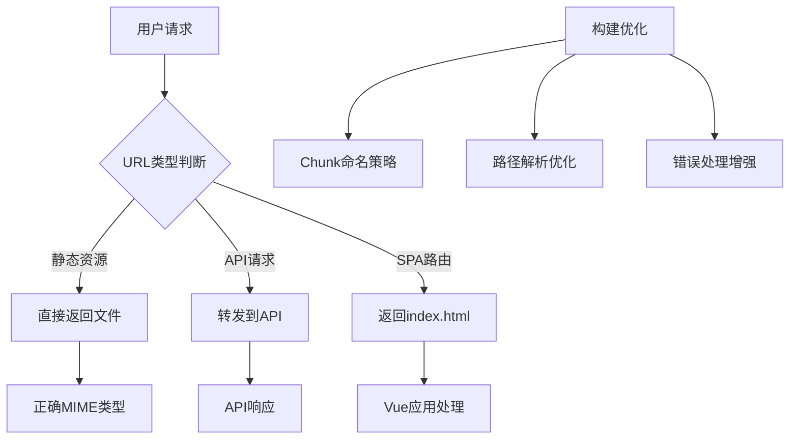

# 模块加载失败修复设计文档

## 概述

本设计文档旨在解决生产环境中动态模块加载失败的问题。通过分析错误日志，问题的根本原因是Vercel部署配置中的路由重写规则导致JavaScript chunk文件被错误地作为HTML页面返回，从而引发MIME类型错误。

## 架构

### 问题分析

当前错误的技术栈：
1. **Vite构建系统** - 使用代码分割生成chunk文件
2. **Vue Router** - 使用动态导入进行路由级代码分割
3. **Vercel部署** - 使用rewrites规则处理SPA路由

**错误流程：**
```
用户点击卡片 → 路由导航 → 动态导入EventDetailPage → 
请求chunk文件 → Vercel重写规则匹配 → 返回index.html → 
MIME类型错误 → 模块加载失败
```

### 解决方案架构



## 组件和接口

### 1. Vercel配置优化

**当前问题配置：**
```json
{
  "rewrites": [
    {
      "source": "/((?!api/|.*\\..*).*)",
      "destination": "/index.html"
    }
  ]
}
```

**优化后配置：**
```json
{
  "rewrites": [
    {
      "source": "/api/(.*)",
      "destination": "/api/$1"
    },
    {
      "source": "/((?!api/|assets/|chunks/|pages/|.*\\.[a-zA-Z0-9]+$).*)",
      "destination": "/index.html"
    }
  ]
}
```

### 2. Vite构建配置优化

**接口定义：**
```typescript
interface BuildConfig {
  chunkNaming: ChunkNamingStrategy
  assetNaming: AssetNamingStrategy
  rollupOptions: RollupOptions
}

interface ChunkNamingStrategy {
  pattern: string
  hashLength: number
  includeDirectory: boolean
}
```

### 3. 动态导入错误处理

**接口定义：**
```typescript
interface ModuleLoader {
  loadModule(path: string): Promise<any>
  retryLoad(path: string, maxRetries: number): Promise<any>
  handleLoadError(error: Error, path: string): void
}

interface LoadError {
  type: 'MIME_ERROR' | 'NETWORK_ERROR' | 'TIMEOUT_ERROR'
  originalError: Error
  path: string
  retryCount: number
}
```

## 数据模型

### 模块加载状态

```typescript
interface ModuleLoadState {
  path: string
  status: 'loading' | 'loaded' | 'error' | 'retrying'
  error?: LoadError
  retryCount: number
  lastAttempt: Date
}

interface LoadingContext {
  route: string
  component: string
  chunks: string[]
  dependencies: string[]
}
```

### 错误追踪模型

```typescript
interface LoadErrorRecord {
  id: string
  timestamp: Date
  userAgent: string
  url: string
  expectedMimeType: string
  actualMimeType: string
  responseStatus: number
  retryAttempts: number
  resolved: boolean
}
```

## 正确性属性

*属性是应该在系统所有有效执行中保持为真的特征或行为——本质上是关于系统应该做什么的正式声明。属性作为人类可读规范和机器可验证正确性保证之间的桥梁。*

### 属性反思

在分析所有可测试属性后，我识别出以下冗余和合并机会：

**冗余消除：**
- 属性1.1和1.2都测试模块加载成功，可以合并为一个综合的模块加载属性
- 属性2.1和2.4都验证构建输出的正确性，可以合并
- 属性3.1和3.2都涉及错误处理，可以合并为错误处理综合属性
- 属性4.1和4.5都测试重试机制，可以合并

**合并后的核心属性：**

**属性 1: 模块加载成功性**
*对于任何*有效的路由路径和活动ID，当用户导航到该路径时，模块加载系统应该成功加载对应的组件模块
**验证需求: Requirements 1.1, 1.2**

**属性 2: MIME类型正确性**
*对于任何*chunk文件请求，部署环境应该返回正确的JavaScript MIME类型而不是HTML
**验证需求: Requirements 1.5, 2.3**

**属性 3: 构建输出完整性**
*对于任何*构建过程，构建系统应该生成有效的chunk文件映射，且所有动态导入路径在构建后都是可访问的
**验证需求: Requirements 2.1, 2.4**

**属性 4: 路由配置无冲突性**
*对于任何*部署配置更新，静态资源路由和SPA路由应该不会相互冲突
**验证需求: Requirements 2.5**

**属性 5: 错误处理完整性**
*对于任何*模块加载失败场景，系统应该记录详细错误信息并提供用户友好的错误界面和重试选项
**验证需求: Requirements 1.3, 3.1, 3.2**

**属性 6: 重试机制限制性**
*对于任何*网络不稳定情况，模块加载系统应该最多重试3次，失败后提供手动选项
**验证需求: Requirements 4.1, 4.5**

**属性 7: 优雅降级一致性**
*对于任何*部分模块加载失败的情况，系统应该加载核心功能并保持基本可用性
**验证需求: Requirements 4.3**

**属性 8: 离线缓存回退**
*对于任何*离线状态下的模块请求，系统应该尝试使用缓存版本作为回退策略
**验证需求: Requirements 4.4**

**属性 9: 部署验证完整性**
*对于任何*部署完成后，系统应该验证所有关键路由的可访问性
**验证需求: Requirements 3.4**

<function_calls>
<invoke name="prework">
<parameter name="featureName">module-loading-fix

## 错误处理

### 1. MIME类型错误处理

```typescript
class MimeTypeErrorHandler {
  detectMimeError(response: Response): boolean {
    const contentType = response.headers.get('content-type')
    return contentType?.includes('text/html') && 
           response.url.includes('.js')
  }

  async handleMimeError(error: Error, path: string): Promise<void> {
    // 记录错误详情
    errorLogger.log({
      type: 'MIME_ERROR',
      path,
      expectedType: 'application/javascript',
      actualType: 'text/html',
      timestamp: new Date()
    })

    // 尝试fallback策略
    await this.tryFallbackLoad(path)
  }
}
```

### 2. 网络错误重试机制

```typescript
class NetworkRetryHandler {
  private maxRetries = 3
  private retryDelay = 1000

  async retryLoad(loadFn: () => Promise<any>, path: string): Promise<any> {
    let lastError: Error
    
    for (let i = 0; i < this.maxRetries; i++) {
      try {
        return await loadFn()
      } catch (error) {
        lastError = error
        if (i < this.maxRetries - 1) {
          await this.delay(this.retryDelay * Math.pow(2, i))
        }
      }
    }
    
    throw new RetryExhaustedError(lastError, this.maxRetries)
  }
}
```

### 3. 优雅降级策略

```typescript
interface FallbackStrategy {
  canFallback(error: LoadError): boolean
  getFallbackComponent(): Promise<any>
}

class ModuleFallbackHandler implements FallbackStrategy {
  canFallback(error: LoadError): boolean {
    return error.type === 'MIME_ERROR' || 
           error.type === 'NETWORK_ERROR'
  }

  async getFallbackComponent(): Promise<any> {
    // 返回简化版本的组件
    return import('./components/SimplifiedEventDetail.vue')
  }
}
```

## 测试策略

### 单元测试方法

**Vercel配置测试：**
- 验证路由重写规则的正确性
- 测试静态资源路径匹配
- 验证MIME类型头设置

**模块加载器测试：**
- 测试正常加载流程
- 模拟各种错误场景
- 验证重试机制
- 测试fallback策略

### 属性基础测试方法

本项目将使用 **Vitest** 作为属性基础测试框架，配合 **fast-check** 库进行属性生成。每个属性基础测试将运行最少 **100次迭代** 以确保充分的随机性覆盖。

**测试库配置：**
```typescript
import { describe, it, expect } from 'vitest'
import fc from 'fast-check'

// 每个属性测试必须运行至少100次迭代
const PROPERTY_TEST_ITERATIONS = 100
```

**属性测试标记格式：**
每个属性基础测试必须使用以下格式进行标记：
```typescript
// **Feature: module-loading-fix, Property 1: 模块加载成功性**
```

**测试实现要求：**
- 每个正确性属性必须由单独的属性基础测试实现
- 测试必须生成随机输入来验证属性在所有情况下都成立
- 使用fast-check库的生成器创建测试数据
- 所有测试必须明确引用设计文档中的属性编号

### 集成测试

**端到端路由测试：**
- 测试完整的用户导航流程
- 验证生产环境的模块加载
- 测试错误恢复机制

**部署验证测试：**
- 自动化部署后的健康检查
- 验证所有关键路由的可访问性
- 测试静态资源的正确MIME类型

### 性能测试

**加载性能基准：**
- 模块加载时间测量
- 网络条件变化下的性能
- 缓存效果验证

**错误恢复性能：**
- 重试机制的响应时间
- Fallback组件的加载速度
- 用户体验影响评估