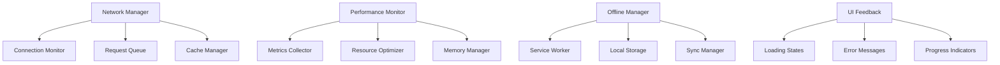

# Network Performance Optimization Design Document

## Overview

This design document outlines the implementation of comprehensive network performance optimization and resilience features for the event management platform. The system will provide optimal user experience during network fluctuations, slow connections, and high-traffic scenarios while maintaining functionality and data integrity.

The solution focuses on four key areas:
1. **Network Resilience**: Graceful handling of connectivity issues and failures
2. **Performance Optimization**: Fast loading and efficient resource utilization
3. **Offline Capability**: Limited functionality during network interruptions
4. **Monitoring & Analytics**: Performance tracking and optimization insights

## Architecture

### Core Components



### Integration with Existing Architecture

The performance optimization system integrates with the existing Vue 3 + Supabase architecture:

- **Store Integration**: Extends the existing `appStore.ts` with network-aware state management
- **Component Enhancement**: Adds performance-optimized loading states to existing components
- **Service Worker**: Implements caching and offline functionality
- **Monitoring**: Leverages existing performance monitoring utilities

## Components and Interfaces

### 1. Network Manager

**Purpose**: Central coordinator for all network-related operations

```typescript
interface NetworkManager {
  // Connection monitoring
  isOnline: boolean
  connectionQuality: 'fast' | 'slow' | 'offline'
  
  // Request management
  executeRequest<T>(request: NetworkRequest): Promise<T>
  retryFailedRequests(): Promise<void>
  
  // Queue management
  queueRequest(request: NetworkRequest): void
  processQueue(): Promise<void>
}

interface NetworkRequest {
  id: string
  url: string
  method: string
  data?: any
  priority: 'high' | 'medium' | 'low'
  retryCount: number
  maxRetries: number
}
```

### 2. Cache Manager

**Purpose**: Intelligent caching for API responses and static assets

```typescript
interface CacheManager {
  // Cache operations
  get<T>(key: string): Promise<T | null>
  set<T>(key: string, value: T, ttl?: number): Promise<void>
  invalidate(pattern: string): Promise<void>
  
  // Cache strategies
  cacheFirst<T>(request: CacheRequest<T>): Promise<T>
  networkFirst<T>(request: CacheRequest<T>): Promise<T>
  staleWhileRevalidate<T>(request: CacheRequest<T>): Promise<T>
}

interface CacheRequest<T> {
  key: string
  fetcher: () => Promise<T>
  ttl?: number
  strategy?: 'cache-first' | 'network-first' | 'stale-while-revalidate'
}
```

### 3. Performance Monitor

**Purpose**: Real-time performance tracking and optimization

```typescript
interface PerformanceTracker {
  // Metrics collection
  recordMetric(name: string, value: number, tags?: Record<string, string>): void
  recordTiming(name: string, duration: number): void
  recordError(error: NetworkError): void
  
  // Performance analysis
  getMetrics(timeRange?: TimeRange): PerformanceMetrics
  getRecommendations(): OptimizationRecommendation[]
}

interface PerformanceMetrics {
  loadTimes: Record<string, number>
  errorRates: Record<string, number>
  cacheHitRates: Record<string, number>
  memoryUsage: MemoryStats
  networkQuality: NetworkQualityMetrics
}
```

### 4. Offline Manager

**Purpose**: Offline functionality and data synchronization

```typescript
interface OfflineManager {
  // Offline state
  isOffline: boolean
  hasOfflineCapability(feature: string): boolean
  
  // Data synchronization
  syncPendingChanges(): Promise<SyncResult>
  storePendingChange(change: PendingChange): void
  
  // Offline UI
  getOfflineMessage(context: string): string
  getAvailableFeatures(): string[]
}

interface PendingChange {
  id: string
  type: 'create' | 'update' | 'delete'
  table: string
  data: any
  timestamp: number
}
```

## Data Models

### Network State

```typescript
interface NetworkState {
  isOnline: boolean
  connectionType: 'wifi' | 'cellular' | 'ethernet' | 'unknown'
  effectiveType: 'slow-2g' | '2g' | '3g' | '4g' | 'unknown'
  downlink: number // Mbps
  rtt: number // milliseconds
  saveData: boolean
}
```

### Performance Metrics

```typescript
interface LoadingMetrics {
  startTime: number
  endTime: number
  duration: number
  resourceSize: number
  cacheHit: boolean
  errorCount: number
}

interface UserExperienceMetrics {
  firstContentfulPaint: number
  largestContentfulPaint: number
  cumulativeLayoutShift: number
  firstInputDelay: number
  timeToInteractive: number
}
```

### Cache Configuration

```typescript
interface CacheConfig {
  maxSize: number // bytes
  maxAge: number // milliseconds
  strategies: Record<string, CacheStrategy>
  excludePatterns: string[]
}

interface CacheStrategy {
  name: 'cache-first' | 'network-first' | 'stale-while-revalidate'
  ttl: number
  maxRetries: number
}
```

## Correctness Properties

*A property is a characteristic or behavior that should hold true across all valid executions of a system-essentially, a formal statement about what the system should do. Properties serve as the bridge between human-readable specifications and machine-verifiable correctness guarantees.*

### Property Reflection

After reviewing all properties identified in the prework analysis, I've identified several areas where properties can be consolidated or where redundancy exists:

- Properties 1.1 and 1.5 both deal with preserving user input during network failures - these can be combined into a comprehensive input preservation property
- Properties 2.4 and cache-related behaviors can be consolidated into comprehensive caching properties
- Properties 5.1, 5.3, and 5.4 all relate to offline functionality and can be combined into comprehensive offline behavior properties
- Properties 6.1, 6.2, and 6.3 all relate to monitoring and can be consolidated into comprehensive monitoring properties

### Network Resilience Properties

**Property 1: Input preservation during network failures**
*For any* form submission or critical operation, when network connectivity fails, the system should preserve all user input and provide clear failure notification with manual retry options
**Validates: Requirements 1.1, 1.5**

**Property 2: User-friendly error handling**
*For any* network request that fails due to timeout or connection issues, the system should display appropriate error messages with retry mechanisms
**Validates: Requirements 1.2**

**Property 3: Connectivity restoration handling**
*For any* connectivity restoration event, the system should notify users and enable manual retry of previously failed operations
**Validates: Requirements 1.3**

**Property 4: Loading progress feedback**
*For any* network operation during slow connections, the system should provide visual feedback indicating loading progress
**Validates: Requirements 1.4**

### Performance Optimization Properties

**Property 5: Page load performance**
*For any* page visit under 3G network conditions, critical content should load within 3 seconds
**Validates: Requirements 2.1**

**Property 6: Layout stability during loading**
*For any* image loading operation, placeholder content should be displayed to maintain layout stability
**Validates: Requirements 2.2**

**Property 7: Large dataset handling**
*For any* request for large datasets, the system should implement pagination or virtual scrolling to optimize initial load time
**Validates: Requirements 2.3**

**Property 8: Resource caching efficiency**
*For any* repeated resource request, the system should serve from cache when appropriate to reduce network usage
**Validates: Requirements 2.4**

**Property 9: Code splitting optimization**
*For any* JavaScript bundle loading, only necessary modules should be loaded initially through code splitting
**Validates: Requirements 2.5**

### Responsiveness Properties

**Property 10: Non-blocking operations**
*For any* heavy operation, the system should use background processing to prevent UI thread blocking
**Validates: Requirements 3.2**

**Property 11: Memory leak prevention**
*For any* extended session, the system should implement cleanup mechanisms to prevent memory leaks
**Validates: Requirements 3.3**

**Property 12: Update batching**
*For any* series of real-time updates, the system should batch updates to prevent excessive re-rendering
**Validates: Requirements 3.5**

### Data Efficiency Properties

**Property 13: Responsive image serving**
*For any* image display, appropriately sized images should be served based on device and viewport dimensions
**Validates: Requirements 4.1**

**Property 14: Data usage options**
*For any* user preference setting, options to reduce data usage should be available and functional
**Validates: Requirements 4.4**

**Property 15: Incremental updates**
*For any* content update, the system should use incremental updates rather than full page reloads
**Validates: Requirements 4.5**

### Offline Capability Properties

**Property 16: Comprehensive offline functionality**
*For any* previously visited page accessed offline, cached content should be displayed with appropriate offline indicators, and essential assets should be available
**Validates: Requirements 5.1, 5.3**

**Property 17: Offline form handling**
*For any* form interaction during offline periods, input should be stored locally with clear indicators about connectivity requirements
**Validates: Requirements 5.2**

**Property 18: Offline feature availability**
*For any* offline mode activation, the system should clearly indicate which features are available and unavailable
**Validates: Requirements 5.4**

**Property 19: Connectivity status UI updates**
*For any* connectivity status change, the user interface should update to reflect current capabilities
**Validates: Requirements 5.5**

### Monitoring Properties

**Property 20: Comprehensive performance monitoring**
*For any* performance issue, network error, or slow loading condition, the system should log relevant metrics and error details for analysis
**Validates: Requirements 6.1, 6.2, 6.3**

**Property 21: Graceful degradation**
*For any* system resource stress condition, the system should implement graceful degradation strategies
**Validates: Requirements 6.5**

## Error Handling

### Network Error Classification

```typescript
enum NetworkErrorType {
  CONNECTION_LOST = 'connection_lost',
  TIMEOUT = 'timeout',
  SERVER_ERROR = 'server_error',
  RATE_LIMITED = 'rate_limited',
  OFFLINE = 'offline'
}

interface NetworkError {
  type: NetworkErrorType
  message: string
  retryable: boolean
  retryAfter?: number
  originalRequest: NetworkRequest
}
```

### Error Recovery Strategies

1. **Exponential Backoff**: Progressive retry delays for transient failures
2. **Circuit Breaker**: Temporary suspension of requests to failing endpoints
3. **Fallback Responses**: Cached or default responses when network fails
4. **User Notification**: Clear, actionable error messages with retry options

### Graceful Degradation

- **Feature Disabling**: Non-essential features disabled during poor connectivity
- **Quality Reduction**: Lower quality images/content for slow connections
- **Offline Mode**: Core functionality available without network
- **Progressive Enhancement**: Features enabled as connectivity improves

## Testing Strategy

### Unit Testing Approach

**Network Manager Tests**:
- Connection state management
- Request queuing and retry logic
- Error handling and recovery
- Cache integration

**Performance Monitor Tests**:
- Metrics collection accuracy
- Performance threshold detection
- Memory leak detection
- Resource optimization

**Offline Manager Tests**:
- Data synchronization logic
- Offline state management
- Service worker integration
- Local storage operations

### Property-Based Testing Requirements

The testing strategy will use **fast-check** (already installed) as the property-based testing library. Each property-based test will run a minimum of 100 iterations to ensure comprehensive coverage of the random input space.

**Network Resilience Properties**:
- Generate random network failure scenarios and verify input preservation
- Test various error conditions and verify appropriate user feedback
- Simulate connectivity changes and verify proper handling

**Performance Properties**:
- Generate random page loads and verify performance thresholds
- Test various dataset sizes and verify optimization strategies
- Simulate different network conditions and verify adaptive behavior

**Offline Properties**:
- Generate random offline scenarios and verify functionality
- Test various data synchronization conditions
- Verify proper UI state management during connectivity changes

**Monitoring Properties**:
- Generate random performance conditions and verify logging
- Test various error scenarios and verify metric collection
- Simulate resource stress and verify graceful degradation

Each property-based test will be tagged with comments explicitly referencing the correctness property from this design document using the format: **Feature: network-performance-optimization, Property {number}: {property_text}**

### Integration Testing

**End-to-End Scenarios**:
- Complete user workflows under various network conditions
- Cross-browser compatibility testing
- Mobile device performance testing
- Offline-to-online transition testing

**Performance Testing**:
- Load testing under simulated network conditions
- Memory usage monitoring during extended sessions
- Cache effectiveness measurement
- Bundle size and loading optimization verification

### Test Environment Setup

- **Network Simulation**: Tools to simulate various connection speeds and reliability
- **Performance Monitoring**: Integration with existing performance monitoring utilities
- **Cache Testing**: Verification of cache strategies and invalidation
- **Offline Testing**: Service worker and offline functionality validation