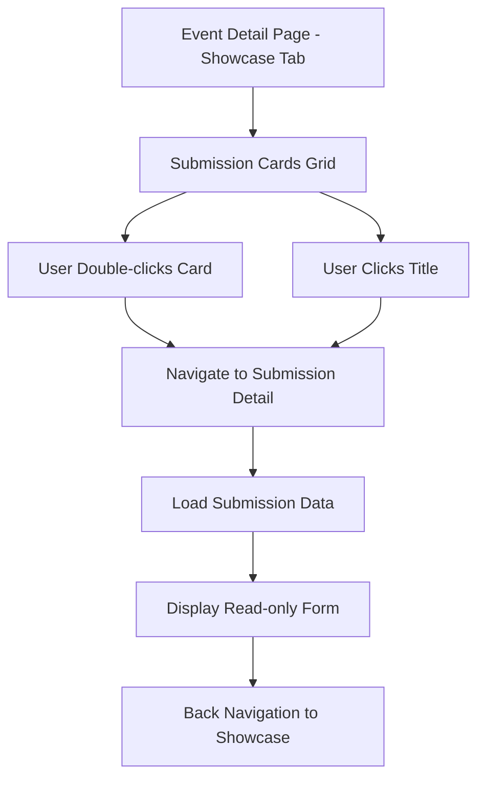

# Design Document

## Overview

The submission detail view feature provides a comprehensive, read-only interface for viewing detailed information about submitted projects in the event management platform. This feature extends the existing submission showcase by allowing users to access full project details through intuitive navigation from submission cards or titles.

The design leverages the existing Vue 3 + TypeScript architecture, Supabase backend, and established design system to create a consistent user experience that mirrors the submission form layout but in a read-only format.

## Architecture

### Component Structure

The submission detail view follows the established page-component pattern:

```
src/pages/SubmissionDetailPage.vue (new)
├── Uses existing SubmissionCard component for consistency
├── Integrates with existing router and store patterns
└── Leverages existing Supabase data access patterns
```

### Navigation Flow



### URL Structure

The feature adds a new route pattern:
- `/events/:eventId/submissions/:submissionId` - Direct access to submission detail
- Maintains breadcrumb navigation context

## Components and Interfaces

### New Components

#### SubmissionDetailPage.vue
- **Purpose**: Main page component for displaying submission details
- **Props**: 
  - `eventId: string` (from route params)
  - `submissionId: string` (from route params)
- **Key Features**:
  - Read-only form layout matching SubmissionPage.vue
  - Navigation breadcrumbs
  - Loading and error states
  - Responsive design

### Modified Components

#### SubmissionCard.vue
- **Enhancement**: Add double-click handler for navigation
- **Enhancement**: Make title clickable for navigation
- **Maintains**: Existing single-click behavior for future extensibility

#### EventDetailPage.vue
- **Enhancement**: Update `handleSubmissionClick` to navigate to detail view
- **Maintains**: Existing showcase grid layout and functionality

### Router Integration

New route configuration:
```typescript
{
  path: '/events/:eventId/submissions/:submissionId',
  name: 'submission-detail',
  component: () => import('./pages/SubmissionDetailPage.vue')
}
```

## Data Models

### Existing Models (No Changes Required)

The feature utilizes existing data models:
- `Submission` - Core submission data
- `SubmissionWithTeam` - Submission with team information
- `Profile` - User profile information

### Data Access Patterns

Leverages existing store methods:
- `store.loadSubmissions(eventId)` - For loading submission data
- `store.getSubmissionsForEvent(eventId)` - For accessing cached submissions
- Supabase storage methods for file access

## Error Handling

### Error Scenarios and Responses

1. **Submission Not Found**: Redirect to 404 page with navigation back to event
2. **Network Errors**: Display error message with retry functionality
3. **Missing Images**: Show placeholder with appropriate styling
4. **Corrupted Data**: Display fallback content with error indication
5. **Access Denied**: Redirect to event page with appropriate message

### Loading States

- **Initial Load**: Skeleton layout matching form structure
- **Image Loading**: Progressive image loading with placeholders
- **File Access**: Loading indicators for download preparation

## Testing Strategy

### Unit Testing
- Component rendering with various submission data states
- Navigation behavior testing
- Error handling verification
- Responsive layout testing

### Property-Based Testing
The testing approach will use **Vitest** with **fast-check** for property-based testing, configured to run a minimum of 100 iterations per property test.

Each property-based test will be tagged with comments explicitly referencing the correctness property using the format: `**Feature: submission-detail-view, Property {number}: {property_text}**`

Property-based tests will verify universal behaviors across all valid submission data, while unit tests will cover specific examples and edge cases.

## Correctness Properties

*A property is a characteristic or behavior that should hold true across all valid executions of a system-essentially, a formal statement about what the system should do. Properties serve as the bridge between human-readable specifications and machine-verifiable correctness guarantees.*

### Property Reflection

After analyzing all acceptance criteria, several properties can be consolidated to eliminate redundancy:

- Properties 1.1 and 1.2 (double-click and title click navigation) can be combined into a single comprehensive navigation property
- Properties 2.2 and 2.5 (project information and metadata display) can be merged into a complete information display property
- Properties 4.1 and 4.2 (responsive layout and image scaling) can be unified into a responsive design property
- Properties 5.2 and 5.3 (link and file security) can be combined into a secure content access property

### Core Properties

**Property 1: Navigation triggers detail view**
*For any* submission card or title element, when a user performs the designated interaction (double-click on card or click on title), the system should navigate to the submission detail view for that specific submission
**Validates: Requirements 1.1, 1.2**

**Property 2: Detail view displays complete submission data**
*For any* valid submission, the detail view should display all submission fields (project name, team name, description, cover image, video link, submission content, timestamp, submitter) in the same order as the submission form
**Validates: Requirements 1.3, 1.4, 1.5, 2.2, 2.5**

**Property 3: Read-only form presentation**
*For any* submission detail view, all displayed form elements should be in read-only format without any editable input capabilities
**Validates: Requirements 1.4**

**Property 4: Cover image display with aspect ratio preservation**
*For any* submission with a cover image, the detail view should display the image while preserving its original aspect ratio
**Validates: Requirements 2.1**

**Property 5: Submission mode conditional display**
*For any* submission, the detail view should display either link information (with password if provided) or file download access based on the submission's link_mode value
**Validates: Requirements 2.3, 2.4**

**Property 6: Navigation elements presence**
*For any* submission detail view, the interface should contain breadcrumb navigation, back button, and correct URL reflecting the current submission
**Validates: Requirements 3.1, 3.2, 3.3, 3.5**

**Property 7: Responsive layout adaptation**
*For any* submission detail view, the layout should adapt appropriately across different viewport sizes (mobile, tablet, desktop) with proper image scaling and loading states
**Validates: Requirements 4.1, 4.2**

**Property 8: Keyboard accessibility**
*For any* interactive element in the submission detail view, keyboard navigation should be properly supported
**Validates: Requirements 4.4**

**Property 9: Loading and error state handling**
*For any* submission detail view access, appropriate loading states should be displayed during data fetching, and error states should be shown when data loading fails
**Validates: Requirements 4.5**

**Property 10: Missing image placeholder**
*For any* submission without a cover image, the detail view should display an appropriate placeholder image with consistent styling
**Validates: Requirements 5.1**

**Property 11: Secure content access**
*For any* submission containing links or files, the content should be displayed or accessed through secure methods without XSS vulnerabilities
**Validates: Requirements 5.2, 5.3**

**Property 12: Corrupted data graceful handling**
*For any* submission with corrupted or incomplete data, the detail view should display appropriate error messages and fallback content without crashing
**Validates: Requirements 5.4**